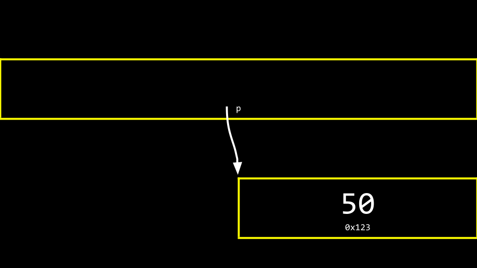

# CS50 Memeory 


# Hexademcimal 

In decimal we use ```{0,1,2,3,4,5,6,7,8,9,0}``` and similarly in computer science we usually encounter binary ```{0,1}```. For a number represeted in decimal, we know they way of converting number in decimal to binary. Apart from decimal and binary, **hexadecimal** or **base-16** is widely used in images. In hexadecimal, there are elements which are ```{0,1,2,3,4,5,6,7,8,9,A,B,C,D,E,F}```. Suppose we have two digits in hexadecimal, we can read it like 

$$
\overbrace{\#}^\text{16}  \overbrace{\#}^{\text{1}}
$$

For instance, if we have FF in hexadecimal, we can calculate it decimal representation as 

$$
\text{FF} = (15) \times 16^{1} + 15 \times 16^{0} = 255
$$

Here are some examples of hexadecimal representation: 

* 1 in base-10 = 01 in base-16 
* 10 in base-10 = 0A in base-16 
* 16 in base-10 = 10 in base-16 
* 17 in base-10 = 11 in base-16 
  
In computer memory, to avoid ambiguity we use ```0x``` to prefix with the hexadecimal numbers. Therefore, in computer memory the we can represent the address in hexadecimal like 

 *Hexadecimal representation of computer memory addresses.*

For instance, if we store an intger (which takes *4 bytes*) in computer memeory, the graphical representation of how an integer stored in memory like 


To print the location of the memory address where the integer 50 being stored, we can use the **pointer**. 


# Pointer 
There are two operators associated with the concept of pointer. 

* ```&``` allows us the get the address of a piece of data in memory 
* ```*``` is a **de-reference** operator which allows us to go specific memory address

```c
#include <stdio.h>
int main()
{
    int n = 50;
    printf("%p\n", &n); 
}
```

If we excute the above code, we will get the following address ```0x16f8bb13c```. We can also use ```*``` in front of a variable to tell C that this variable is a pointer. 

```c
#include <stdio.h>
int main()
{
    int n = 50;
    int *p = &n; 
    printf("%p\n", p); 
}
```

where ```int *p``` refers to an address of an integer or we can call it as a pointer called ```p```. Therefore, ```int *p = &n``` means that we store the address of **integer** ```n``` in new variable called ```p```. 


One thing to notice is that the memory address changes everytime when we run the code. No one cares about the actual memory address. The important thing is thta **we know the computer how to figure the memory addresses out**. Therefore, we should think of a pointer is a variable that points at something else. 


In the above example, we do not care about the actual address of ```n=50``` is, we only care that there is a variable ```p``` and using it we can get the value of ```n```. 


# String and Pointer

```c
#include <cs50.h>
#include <stdio.h>

int main(void){
    string s = "HI!";
    printf("%s\n", s);
    return 0;
}
```


De-reference 

```c
#include <stdio.h>

int main(void){
    int n = 50; 
    int *p = &n; /* star is used as declaring a pointer */
    printf("%i\n", *p); /* *p de-reference the pointer and return what's stored in that address */
}
```


# Pointer Arithmatics 

```c
#include <stdio.h>

int main(void){
    char *s = "HI!";
    printf("%c\n", *s); /* *s deference a pointer and return the character stored in this addresss */
    printf("%c\n", *(s+1)); // Perform pointer arithmetic to print the second char in "HI!"
    printf("%c\n", *(s+2));
}


```


# References 
* [Hexadecimal converter](https://www.rapidtables.com/convert/number/hex-to-decimal.html)
* 