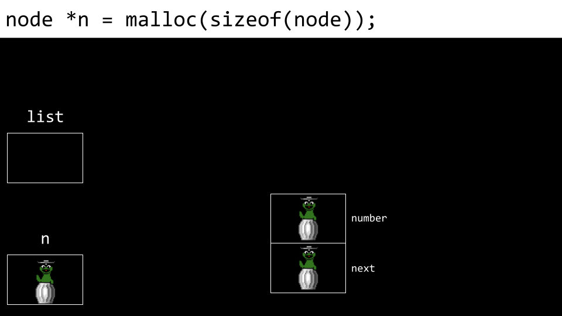
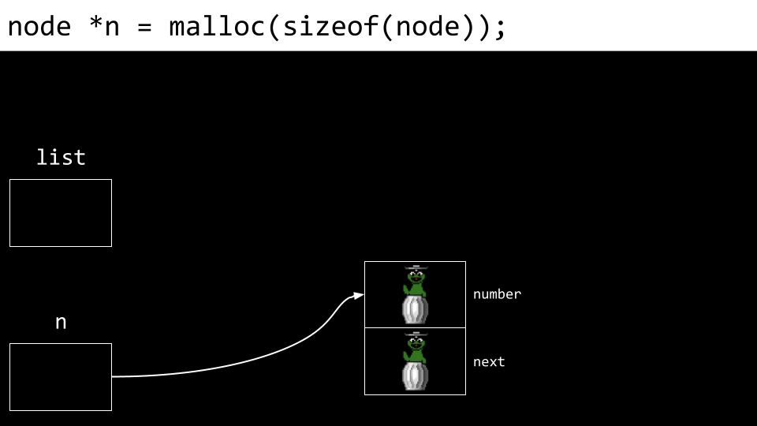
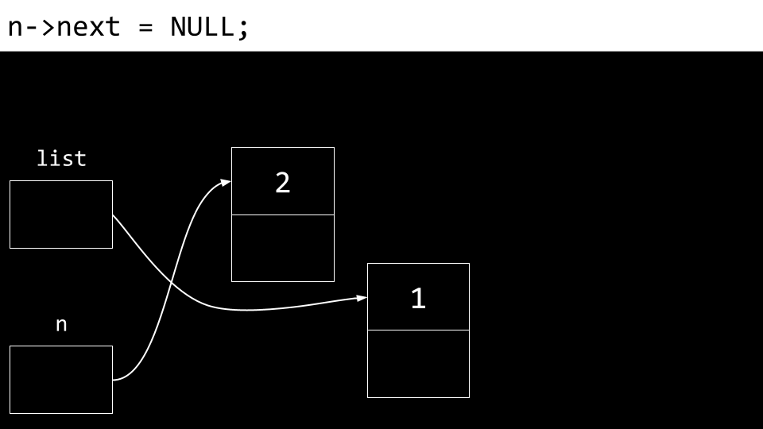
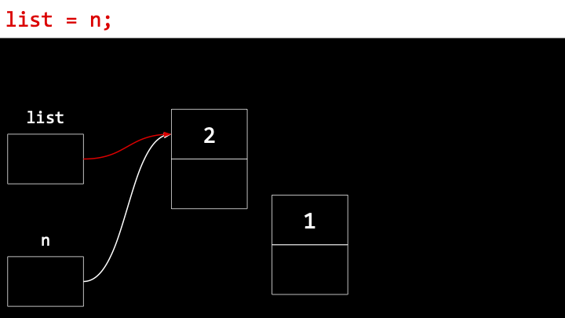
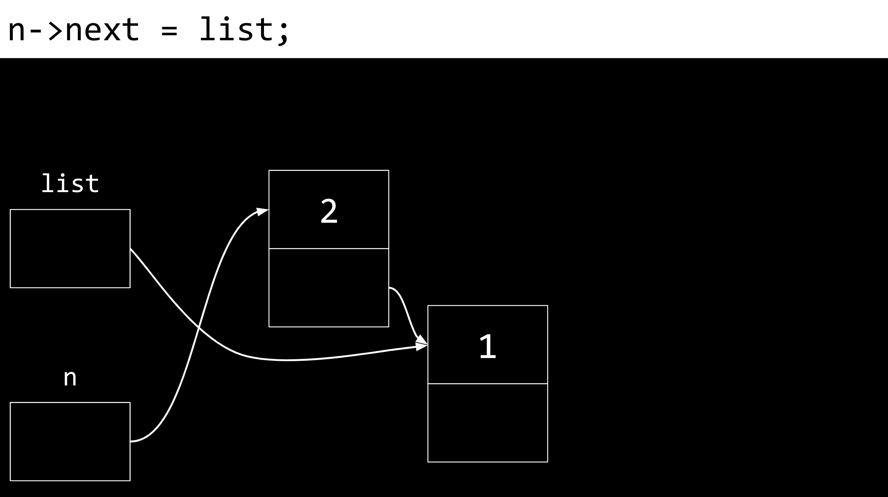

# CS50 Lecture 5: Data Structure in C

# Introduction 

# Queue 
* First In First Out (FIFO)
* Enqueue (adding element at the end )
* Dequeue (first element out - FIFO)
  
# Stacks
* Similar to stack trays one by one in Cafe/ Gmail 
* LIFO (Last In First Out): We take the tray from the top 
* As we always take out the top one, the bottom will not be touched. Consider the trays example. we always take the top tray from stack and no one takes the trays from bottom. Side effect will be the bottom trays be nasty. 
* Operation to stacks 
  * Push (Push something on top of a stack)
  * Pop (Removing something from top of a stack)

```c
const CAPACITY = 50; 

typedef struct { 
    person people[CAPACITY]; 
    int size; 
} stacks; 
```

where the ```CAPACITY``` is the maximum height of stack and ```size``` is the current height of stack. One caveat of setting ```CAPACITY``` is that we let our stack to be finite. Besides, suppose we let ```CAPACITY = 5000``` but we are only using one of these elements. That would be very wasteful for memory.


# Array Resizing 

```c
#include <stdio.h>
#include <stdlib.h>


malloc() /* ask for memory allocation */
realloc() /* ask for memory allocation and resize the array */

```

# Linked Lists 
This part introduces how can we build the data structures and the first example is the linked list. To build our own data structure, the important elements are 
* Struct 
* "." operator which goes inside the structure
* "*" for declare/dereference the pointer 
* "->" new operator which combines "." and "*"

In array by definition all the elements are stored in memory contiguously. In contrast, a (singly) linked list does not require the elements are stored continguosly, they can be stored far apart in computer memory. Besides, unlike an array, we can dynamically grow or shrink the size of a link list. For instance, suppose we have numbers "1,2,3" in an array and "4" in different part of memory, we do not need to use either ```malloc``` or ```realloc``` to ask for additional space to copy and store "1,2,3,4". Rather, we use pointer to point where is the number "4" stored. Now suppose we have 3 numbers stored in different area of memory 


Indeed, this kind of storing elements violates the definition of an array since elements are not stored in continguos. However, they kind of form a "list". In C, there is no list but there is in Python. If we can "point" the elements one by one using "arrow", getting from one to the next and next, then we can achieve the idea of a list. If we want to achieve this, we need to ask for additional memory to store the pointers for each elements for connecting these three numbers in different sector of memory. 


where ```Null``` is used as sentinel value to tell the program to stop there. Besides, to tell the program where is the beginning of a linked list, we need to have an additional pointer ```0x123``` for pointing the first element in the linked list. To abstrat the idea, we now use arrows for pointers 


Now we use ```typedef``` to contruct the liked list data structure. Let's have a try on defining a linked list like below: 

```c
// Wrong Demonstration 
typedef struct{ 
  int number ; 
  node *next; //pointer to another node 
}
node ; 
```
However, the above code is wrong and won't actually compile. The reason is we define node in the last line of code, therefore, the node inside ```typedef``` does not know what a node is. To solve this problem, we can modify the code a bit into 

```c
typedef struct node { 
  int number ; 
  struct node *next; //pointer to another node 
}
node ; 
```

One apparent benefit of using a linked list is faster append as all we need to do is add a pointer. However, there is a tradeoff of computer memory as we need to store both numbers and pointers in linked list, unlike array only sotring the numbers. Moreover, indexing using square bracket notation as array is not applicable for a linked list since square bracket notation assumes elements are stored continguosly inside memory. A direct consequence is the incapability of using binary search as binary search requires the notation of 'middle' of an array, while linked list does not have this kind of notation. 


## Schemetic Representation of building a linked list 
Lets try to build a linked list now. To initializa a linked list, we have to declare the pointer to point at the 'first' element, even for a empty linked list. We can achieve this by 

```c
// codes inside int main() { }
node *list; 
```
This is similar when we define a `string`(not in C) using `char *string`. Pictorially we can understand it by assigning a pointer with a garbage value since we do not assign any value to it, where the garbage value is depicted as green creature icon. 


Next, we assign the pointer ```*list``` to ```NULL``` so we know that the pointer is not grabage and at least having a value ```NULL```. After assigning to NULL, the green creature(denoting grabage) and the box now is empty(NULL). 

Now, we need to create another pointer for the `first` element (if there is). We need to allocate memory for storing both the number and the pointer for the first element by using ```malloc ```

```c
node *list = NULL;
node *n = malloc(sizeof(node)); 
```


when the code is executing from left to right, C will first create a garbage value of the `n` and create another gabage values `number` and `next`. Finally, there will be a pointer for `n` pointing the memory location for `malloc`. 



and one thing to notice is that now `n` is not a garbage value. Now we have two garbage values for the `number` and `next`. We can assign values to them using a new operator `->`

```c
node *list = NULL;
node *n = malloc(sizeof(node)); 
n->number = 1 ; // equivaluent to (*n).number
n->next = NULL; 
```

where the `->` operator is a syntatic sugar for combining deferencing a pointer and going inside to `struct`. 


To final job here is connecting `list` to number `1`. Theoreticlly, this is done by storing the memory address inside `list` and points to `number`. The easiest way is to replace the name of `n` to `list` as `n` is alreadly pointing to `number`.

```c
node *list = NULL;
node *n = malloc(sizeof(node)); 
n->number = 1 ; // equivaluent to (*n).number
n->next = NULL; 
list = n; 
```

Now we are finish for adding one element inside a linked list. To add more elements, we can mimic the procedures above

```c
// there are some codes before 
node *n = malloc(sizeof(node)); 
n->number = 2;  
n->next = NULL; 
```
 

The trickiest part comes with whether should we set `list = n` this time. We we set `list = n`, now the pointer of list will pointer at 2 and there is no pointer points at 1, causing a memory leak and losing the connection to first node. 



To solve this problem, we can modify the `n->next = list`
so that for we can conncet the first and second nodes.

```c
node *n = malloc(sizeof(node)); 
n->number = 2;  
n->next = list;
```



Finally, we can rename `list = n ` safely. 

```c
node *n = malloc(sizeof(node)); 
n->number = 2;  
n->next = list;
list = n ; 
```

One thing to note is that the ordering of number is descending from 2 to 1, though the nodes are really linked. Therefore, instead of appending, we now prepend the new element in the beginning of a linked list, which is similar to stack (Last In, First out  )


## Actual Code 

```c
#include <stdio.h>
#include <stdlib.h>

typedef struct node {
  int number;
  struct node *next;
} node;

int main(int argc, char *argv[]) {
  // Init a linked lsit
  node *list = NULL;

  for (int i = 1; i < argc; i++) {
    int number = atoi(argv[i]);

    node *n = malloc(sizeof(node));
    if (n == NULL) {
      return 1; // exit code if no memory can allocate
    }
    n->number = number;
    n->next = NULL;

    // prepend the linked list, even for first element
    n->next = list;
    list = n;
  }

  // Print numbers inside linked lists
  node *ptr = list;

  while (ptr != NULL) {
    printf("%i\n", ptr->number);
    ptr = ptr->next;
  }

  // Free memory
  ptr = list;
  while (ptr != NULL) {
    node *next = ptr->next;
    free(ptr);
    ptr = next;
  }
}
```
## Time Complexity 

The remaining part of this session is to discuss time complexity of each operation in linked list. 


# Trees 


## Construction of tree 
```c
#include <stdio.h>
#include <stdlib.h>

typedef struct node { 
  int number ; 
  struct node *left ; 
  struct node *right; 

} 
node;
```

## Binary search on trees 

```c

bool search(node *tree, int number)
{ 
  if (tree == NULL){ 
    return false; // exit code 
  }
  else if (number < (*tree).number ){
    return search((*tree).left, number);
  }
  else if (number > tree->number ) { 
    return search( tree->right, number );
  } 
  else if  (number == tree->number) { 
    return true; 
  }
}
```

## Pay off of using Tree 

* Using lots of memory ( `malloc(sizeof(tree))` may cost 20 bytes( 4: int , 8 for each pointer ))


# Hashing 

```c
typedef struct node { 
  char *name; 
  char *number;
  struct node *next; 
} node 

```


# Tries 

```c
typedef struct node { 
  char *number ; 
  struct node *children[26]; 
}node 

//init a trie 
node *trie; // root of a trie 
```
